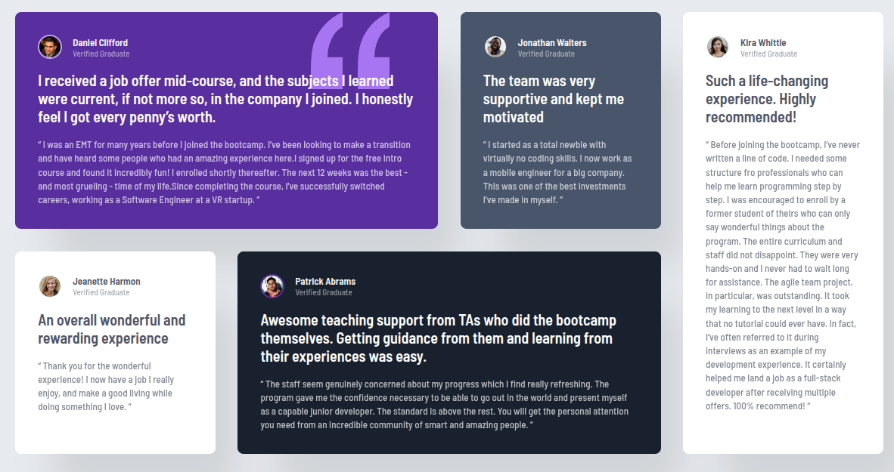

# Frontend Mentor - Testimonials grid section solution

This is a solution to the [Testimonials grid section challenge on Frontend Mentor](https://www.frontendmentor.io/challenges/testimonials-grid-section-Nnw6J7Un7). Frontend Mentor challenges help you improve your coding skills by building realistic projects.

## Table of contents

- [Overview](#overview)
  - [The challenge](#the-challenge)
  - [Screenshot](#screenshot)
  - [Links](#links)
- [My process](#my-process)
  - [Built with](#built-with)
  - [What I learned](#what-i-learned)
  - [AI Collaboration](#ai-collaboration)

## Overview

### The challenge

Users should be able to:

- View the optimal layout for the site depending on their device's screen size

### Screenshot

**Note: Delete this note and the paragraphs above when you add your screenshot. If you prefer not to add a screenshot, feel free to remove this entire section.**

### Links

- Solution URL: [GitHub Repository](https://github.com/gsnezana7/four-card-feature-vue-scss)
- Live Site URL: [https://testimonials-grid-section-vue.netlify.app/](https://testimonials-grid-section-vue.netlify.app/)

## My process

### Built with

- Semantic HTML5 markup
- CSS Grid (using `grid-template-areas` for the stepped layout)
- SCSS (BEM methodology, mixins, and variables)
- Mobile-first workflow
- [Vue.js 3](https://vuejs.org) - Progressive JS Framework
- [Vite](https://vitejs.dev) - Build tool

### What I learned

I practiced creating a complex layout using CSS Grid areas to position the cards according to the design.

### AI Collaboration

I used AI assistants to streamline my development workflow while building this project with Vue.js and SCSS:

- **Tools used**: ChatGPT, Google Search AI.
- **How I used them**:
  - **Debugging**: I used AI to resolve CSS Grid alignment issues and troubleshoot SCSS nesting logic.
  - **Learning Vue.js**: I consulted AI to better understand Vue's component structure and best practices for styling scoped components.
  - **Lighthouse Optimization**: I used AI to analyze Lighthouse audits and implement fixes for accessibility (Aria-labels) and performance.
